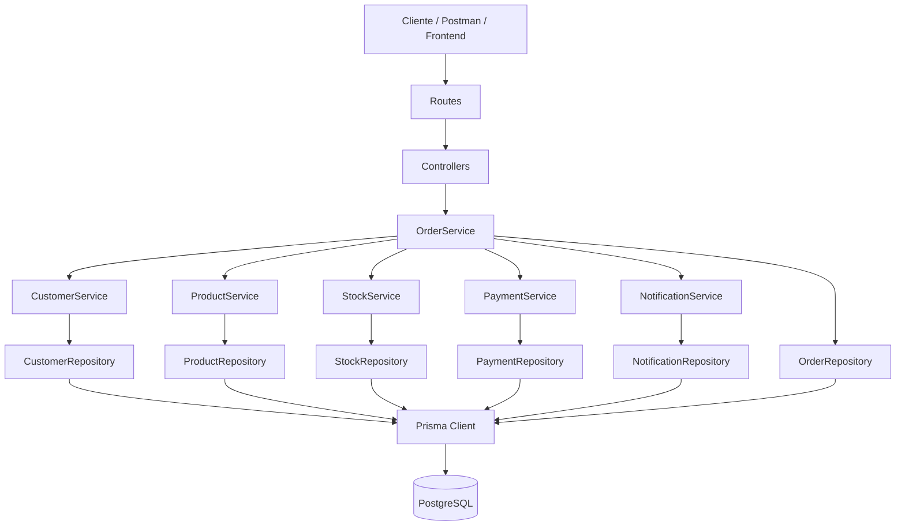

# CP2 SOA - Backend de Pedidos

Backend em **TypeScript + Express + Prisma** organizado por domínio, seguindo a opção B proposta no trabalho.

## Grupo

Guilherme - 554962
Pedro - 555556
Fabrício - 558216
Vitor - 554893
Matheus - 555447

## Visão geral

O sistema implementa um fluxo simplificado de pedidos com os domínios:

- `customers`
- `products`
- `stock`
- `payments`
- `notifications`
- `orders`

A regra central é: o **OrderService** orquestra o fluxo de criação e atualização de pedidos, enquanto os outros services tratam suas responsabilidades específicas.

## Arquitetura

A aplicação foi organizada por domínio e por camadas:

- **Routes**: expõem os endpoints HTTP
- **Controllers**: recebem a request e devolvem a response
- **Services**: concentram as regras de negócio
- **Repositories**: fazem acesso ao banco via Prisma
- **Models/Domain**: representam as entidades e enums do sistema

### Diagrama resumido



## Tecnologias

- Node.js
- TypeScript
- Express
- Prisma ORM
- PostgreSQL
- CORS

## Como executar

1. Suba o PostgreSQL, se quiser via Docker:

```bash
docker compose up -d
```

1. Crie o arquivo `.env` com base em [`.env.example`](./.env.example)
2. Instale dependências:

```bash
npm install
```

1. Gere o client do Prisma e aplique a migration:

```bash
npm run prisma:generate
npm run prisma:migrate
```

1. Suba a aplicação:

```bash
npm run dev
```

Build de produção:

```bash
npm run build
npm start
```

Servidor padrão: `http://localhost:3000`

## Fluxo principal

Ao criar um pedido, o sistema:

1. valida se existem itens
2. consulta produtos
3. verifica disponibilidade em estoque
4. calcula o total
5. processa pagamento simulado
6. atualiza o status do pedido
7. registra notificações

## Regras de negócio implementadas

- pedido não pode ser criado sem itens
- pedido precisa de cliente, itens e valor total
- status do pedido segue:
  - `CRIADO`
  - `AGUARDANDO_PAGAMENTO`
  - `PAGO`
  - `FINALIZADO`
  - `CANCELADO`
- pagamento pode ser aprovado ou recusado
- pedido é cancelado quando o pagamento é recusado
- estoque é reduzido após confirmação do pedido
- notificações são registradas no banco e no console

## Endpoints

### Health

- `GET /health`

### Customers

- `GET /customers`
- `GET /customers/:id`

### Products

- `GET /products`
- `GET /products/:id`

### Stock

- `GET /stock/:productId`

### Payments

- `GET /payments`
- `GET /payments/order/:orderId`

### Notifications

- `GET /notifications`
- `GET /notifications/order/:orderId`

### Orders

- `POST /orders`
- `GET /orders`
- `GET /orders/:id`
- `PATCH /orders/:id/status`

## Exemplo de criação de pedido

```json
{
  "customerId": 1,
  "items": [
    { "productId": 1, "quantity": 2 },
    { "productId": 3, "quantity": 1 }
  ],
  "paymentSimulation": "APPROVE"
}
```

Para simular recusa de pagamento:

```json
{
  "customerId": 1,
  "items": [
    { "productId": 1, "quantity": 2 }
  ],
  "paymentSimulation": "REJECT"
}
```

## Tratamento de erros

O backend responde com códigos coerentes para:

- recurso não encontrado (`404`)
- validação inválida (`422`)
- estoque insuficiente (`409`)
- pagamento recusado (`402`)

## Comunicação entre componentes

O `OrderService` orquestra o fluxo principal e chama os demais services de forma explícita. Isso evita que o controller concentre regra de negócio e deixa cada módulo com responsabilidade clara.

## Se o pagamento ficar indisponível

Nesta implementação síncrona, a criação do pedido seria impactada porque o fluxo depende da resposta do pagamento. Em uma evolução real, o pagamento poderia ser desacoplado com fila, retentativas, circuit breaker e processamento assíncrono.

## Estrutura do projeto

- `src/modules/*`: módulos por domínio
- `src/shared/errors`: erros do sistema
- `src/shared/middlewares`: middleware global
- `src/shared/database`: Prisma e seed
- `prisma/schema.prisma`: schema do banco

## Arquitetura de dados

As entidades principais são:

- `Customer`
- `Product`
- `Order`
- `OrderItem`
- `Payment`
- `Notification`

## Observação final

O projeto usa PostgreSQL + Prisma para ficar mais próximo de um cenário real e atender melhor ao objetivo arquitetural do trabalho.
